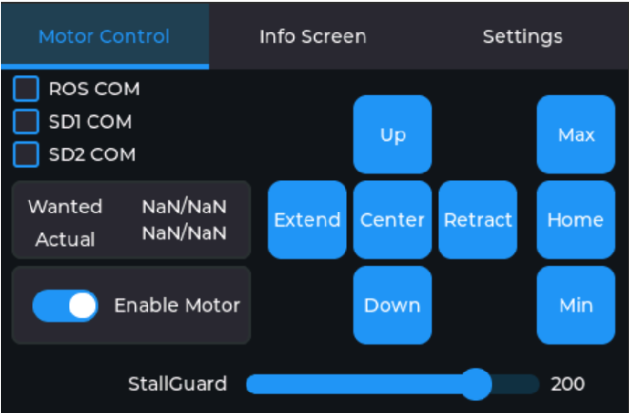
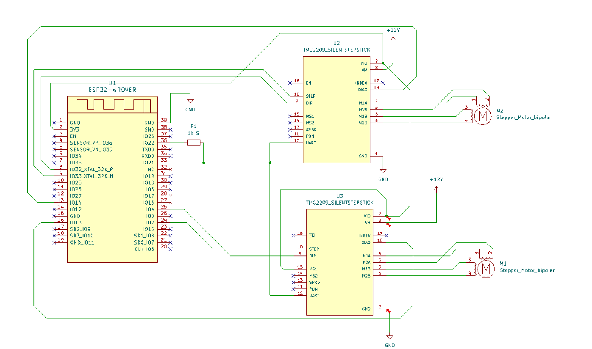

# StepperGUI

StepperGUI is a graphical user interface for controlling a two-axis stepper motor setup, providing an easy and intuitive way to manage motor operations. It is additionally designed to work seamlessly with ROS (rosserial) for more advanced robotic applications.

## Features
- **LVGL GUI**: Easy to use, adapt and implement LVGL GUI for the stepper motor interface.
- **TMC2209 Sensorless Homing**: The stepper motors home with TMC's Stallguard detection.
- **Non-Blocking Tasks**: Stallguard read-outs and position updates are non-blocking and in real-time with the use of FreeRTOS

## Example Images of Implementation:
GUI Main Screen:

Wiring Diagram of WT32-SC01 and TMC2209 for UART communication:

  

